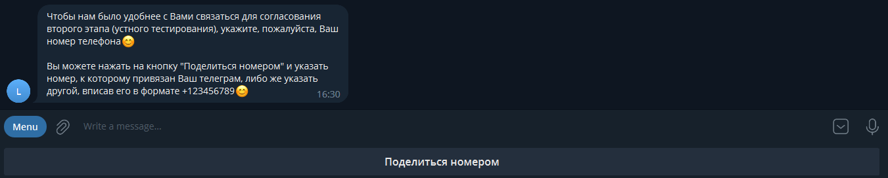
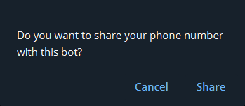

# English Level Tester

## Overview

The "English Level Tester" is a microservice which represents a Telegram bot developed for the online English school
[**"CIAO.BY"**](https://ciao.by/) or [**"GAAGA.PL"**](https://gaaga.pl/). Its purpose is to test the user's English 
level and gather their contact information. This production bot can be accessed via the link provided 
[**"English Level Tester"**](https://t.me/ciaoby_bot).

To support the bot's functionality, two additional microservices have been implemented:

* [**"Telegram User Data Provider"**](https://github.com/delibre/tg-user-data-provider) a REST API designed
to manage user information in the database

* [**"Telegram Admin Bot"**](https://github.com/delibre/tg-admin-bot) a Telegram bot that allows administrators to view
user information.

All three microservices have been deployed on [**"AWS Cloud Computing Services"**](https://aws.amazon.com/). 

### Technologies used

* **Java17**
* **Telegram Bots API** v6.5.0
* **Spring Web Framework** v6.0.0
* **Lombok** v1.18.26
* **Commons Configuration Library** v1.10
* **Commons Logging Library** v1.2
* **SLF4J API** v2.0.5
* **SLF4J Simple** v2.0.5
* **Aspose Cells** v23.3

### TODO

* Allow the administrator to access any chat between the user and the bot upon request and write messages on behalf of 
the bot
* Add FAQ section for the user
* Establish a vault to store configuration properties


## Guidelines

### If you want to start and test the bot locally:

1. Follow the link ["Telegram User Data Provider"](https://github.com/delibre/tg-user-data-provider)
and proceed according to the guidelines 

2. Follow the link  ["Telegram Admin Bot"](https://github.com/delibre/tg-admin-bot)
and proceed according to the guidelines 

3. Download the latest release of this project

4. Create application.properties file
```properties
tech_admin_id = <Telegram user id of technical administrator>
admin_id = <Telegram user id of administrator>
bot_username = <bot's username>
bot_token = <bot's token>
test_duration = 35
user_data_provider_url = http://<IP>:<port>/api/v1/users - url of the "User Data Provider" microservice
```
5. Launch the ["Telegram User Data Provider"](https://github.com/delibre/tg-user-data-provider) application

6. Next, start the ["Telegram Admin Bot"](https://github.com/delibre/tg-admin-bot) application

7. Start the application 

8. Download and install the Telegram app or use the browser version to create an account if you don't have one already

9. After the bot's app was started follow the link ["Local Test Bot"](https://t.me/slava_local_test_bot) 


### User interface:

1. At the bottom of the opened chat, press the "START" button  
 <br/><br/>

2. The bot will ask you to provide your name and surname  
 <br/><br/>

3. Next, you'll be asked to share your phone number 
  <br/><br/>
There are two ways to do this:
* Click on the "Share number" button to send the phone number associated with your account, and then confirm your 
consent to share the number with the bot  
 <br/><br/>
* Provide your phone number manually in the format +123456789

4. You'll be prompted to choose an option for how you heard about the school 
 <br/><br/>

5. The "Start test" button and information about the test will appear 
<br/><br/>

6. Press the "Start test" button to begin the test. You'll have 35 minutes to answer 30 questions  
 <br/><br/>

7. The timer will monitor the time remaining until the end of the test. Once you've answered all the questions, the bot
will send you a test with your and the correct answers. It will then send you a message with the number of correct 
answers and your English level 
  <br/><br/>
If you don't finish the test in time, it will interrupt and send you the questions you managed to answer. <br/><br/>

8. Every 24 hours, a CSV file containing the information about all new users who completed the English test is sent
to the admin bot and received by the admin   
<br/><br/>

9. The administrator can send push notifications to all users who have activated the bot by simply sending a message to
the activated tester bot. After sending the message, the administrator will receive information on how many users 
received the message  

 <br/><br/>

10. All necessary logs are sent to tech admin:  


## Source Code Review 

### Finite State Machine Implementation

The entire application follows the principles of a **finite state machine**, where each response from the bot is 
associated with a specific state implemented as an enum:

```java
public enum StateEnum {
    NEW_USER,
    START,
    GET_FULL_NAME,
    GET_PHONE,
    GET_REFERRAL,
    START_TEST,
    SEND_QUESTION,
    CHECK_ANSWER,
    TEST_FINISHED,
    INFO_SENT
}
```
Each state has its own handler class that implements the necessary logic.

### Bot's Class Implementation

Below is the method that manages the states in the bot's **"CiaoByBot"** class. It is responsible for processing 
incoming messages from users and determining the appropriate state based on the user's current state. The method 
determines the user's state and then applies the appropriate state handler to perform the necessary actions. If the 
user's state is not recognized, an error message is logged and sent to the technical administrator.

```java
private void processMessage(String textMsg, User user) throws Exception {

    if (service.startBot(textMsg, user)) {
        return;
    }

    service.startTestIfStartButtonPressed(textMsg, user);

    switch (user.getState()) {
        case SEND_QUESTION -> {
            UserHandlerState state = new SendQuestionState(service.getServiceCallback());
            state.apply(user);
        }
        case CHECK_ANSWER -> {
            UserMessageHandlerState state = new CheckAnswerState(service.getServiceCallback());
            state.apply(textMsg, user);
        }
        case START -> {
            UserHandlerState state = new StartState(service.getServiceCallback());
            state.apply(user);
        }
        case GET_FULL_NAME -> {
            UserMessageHandlerState state = new GetFullNameState(service.getServiceCallback());
            state.apply(textMsg, user);
        }
        case GET_PHONE -> {
            UserMessageHandlerState state = new GetPhoneState(service.getServiceCallback());
            state.apply(textMsg, user);
        }
        case GET_REFERRAL -> {
            UserMessageHandlerState state = new GetReferralState(service.getServiceCallback());
            state.apply(textMsg, user);
        }
        case START_TEST -> {
            UserMessageHandlerState state = new StartTestState(service.getServiceCallback());
            state.apply(textMsg, user);
        }
        case TEST_FINISHED -> {
            UserHandlerState state = new TestFinishedState(service.getServiceCallback());
            state.apply(user);
            service.getRegisteredUsersMap().remove(user.getChatId());
        }
        case INFO_SENT -> {
            UserHandlerState state = new InfoSentState(service.getServiceCallback());
            state.apply(user);
        }
        default -> {
            log.error(LoggerMessages.processMessageException(), new IllegalStateException());
            sendToTechAdmin(LoggerMessages.processMessageException());
        }
    }
}
```

There is one more important method in this class that maintains responses from user. It is overriden method from 
**"TelegramLongPollingBot"** class. The main purpose of it is to receive updates from active chats with users.

```java
@Override
public void onUpdateReceived(Update update) {
        ...
}
```

The **"CiaoByBot"** class also includes an important feature which is the creation of a **callback** function for the 
execute method from the **"TelegramLongPollingBot"** class. This is used to simplify the implementation of certain 
state classes.

```java
private final BotService service = new BotService((obj) -> {
    Optional<Message> msg = Optional.empty();

    try {
        if (obj instanceof SendMessage) {
            msg = Optional.of(execute((SendMessage) obj));
        } else if (obj instanceof DeleteMessage) {
            execute((DeleteMessage) obj);
        } else if (obj instanceof EditMessageText) {
            execute((EditMessageText) obj);
        } else if (obj instanceof EditMessageReplyMarkup) {
            execute((EditMessageReplyMarkup) obj);
        } else if (obj instanceof AnswerCallbackQuery) {
            execute((AnswerCallbackQuery) obj);
        } else {
            log.error(LoggerMessages.argumentExceptionInServiceVar(), new IllegalArgumentException());
            sendToTechAdmin(new IllegalArgumentException().toString());
        }
    } catch (TelegramApiException e) {
        log.error(LoggerMessages.tgApiExceptionInServiceVar(), e);
        sendToTechAdmin(e.toString());
    }

    return msg;
});
```

### Other Essentials

* The **"RestControllerSingleton"** class is an essential component of the application that follows the **singleton 
design pattern**. It facilitates communication with a REST API and performs CRUD operations on user data. With the 
help of **"RestTemplate"**, this class has methods to add, update, and retrieve user data by making HTTP requests.  


* One more crucial class is a **"EnglishTestSingleton"** that uses the **singleton design pattern** to manage questions
in the English test.


* The following method, called setTimer, which is used in **"StartTestState"** class, utilizes **multithreading** to 
implement a timer for the test. Once the timer runs out, the user's test state is changed to "test finished" and the
timer is canceled.

```java
private void setTimer(User user) {
    TimerTask task = new TimerTask() {
        public void run() {
            try {
                sendText(user.getChatId(), "Время вышло. Результаты вашего теста ниже");
                changeStateToTestFinished(user);
            } catch (Exception e) {
                log.error(LoggerMessages.setTimerException(), e);
            }
            user.getTestState().getTimer().cancel();
        }
    };
    user.getTestState().getTimer().schedule(task, Long.parseLong(AppConfig.getProperty("test_duration")) * 60 * 1000);
}
```

* The **"AppConfig"** class is in charge of handling the configuration profile of the application, such as local or
  production. To ensure the correct configuration is used, the **PROFILE** variable must be set in the environment
  variables of the application.


* The application logs all the required data and forwards it to the technical administrator as push notifications 
through the bot.


## License

MIT

The code in this repository is covered by the included license.

